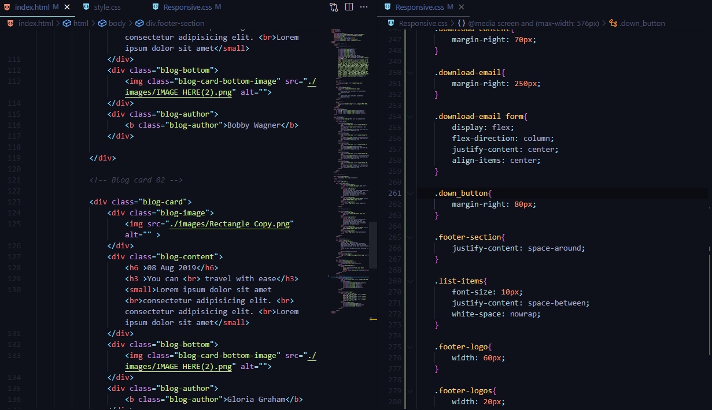
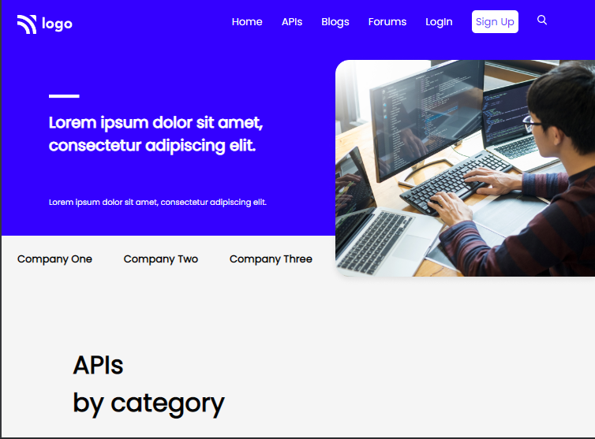
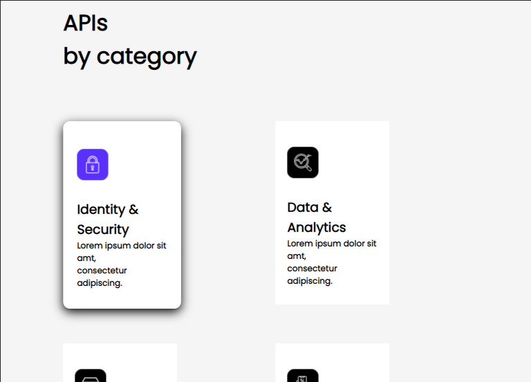
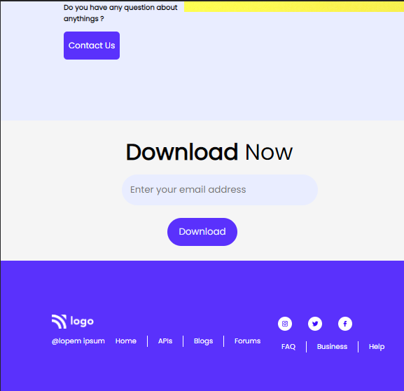

# Web Developer Template for SAAS companies : Ninth Website in pure HTML and CSS

---

## Description
This is a landing page designed for an SAAS/Development firm in pure HTML and CSS without any integration of third party frameworks. The overall design is minimal with basic informations and crucial buttons. The overall structure is a straighforward design consisting of welcome section, company information section, links to firm's blogs, FAQ section and a footer. It took me around `5-7 hours` to built the non-responsive section and extra `2-3 hours` to make it responsive.

My initial hours were dedicated to writing the HTML segments, selecting the correct icons and their size according to the color scheme. Later on, most of my time was consumed in detailing of every object and maintaining their responsiveness for the devices of screen sizes `1024px`, `768px` and `578px`. 
 
The USP of this website would be the API cards next to the welcome segment. Creating those API was very challenging for me. Somehow I managed to structure it with the properties of `flex`, and `box model`. Responsiveness designs are avalible for 3 screen sizes. This project has trained me more on `Flexbox`, `media queries`, `image properties` along with other designing aspects.

---

 

## About The Project

Here's a Screen-Shot of my 9th project along with the code snippets.

 

 

 

 

 

<!-- PROJECT LOGO -->
 

  

<h3 align="center">project 09 - SAAS product design</h3>
  
   
    <a href="https://developer-website-project-09.netlify.app">View Live Demo</a>
  

## Built With

**Using Technologies**

1. `HTML`
2. `CSS`
3. `MarkDown`

> The challenge of this project was to make the design responsive from scratch with pure CSS without using any frameworks .

 

## Live Project

This project is presently deployed in **`Netlify Service`**.

[Live Project URL](https://interiordesign-project10.netlify.app/)
 

<!-- LEARNT -->
 

## Learnt
In This project I learnt the following properties of HTML and CSS.
- In depth of Responsive designs.
- Flexbox and its Properties. 
- Media Queries.
- Box Model.

 
<!-- CONTACT -->

## Contact

- **Name 👨‍💻:** [Harshal Verma](https://github.com/harshalvrm)
- **Email 📧:** [harshalvrm3@gmail.com](mailto:harshalvrm3@gmail.com)
- **Linkedln 📝:** [Click Here](https://www.linkedin.com/in/harshalvrm3/)
- **Blog 📝:** [Hashnode blog](https://xadai.hashnode.dev/)

 

[Project 09 Link](https://developer-website-project-09.netlify.app) 

